# 📝 To-Do App with Google OAuth

A full-stack MERN (MongoDB, Express, React, Node.js) to-do list application featuring secure **Google OAuth authentication** and responsive UI.

## 🔗 Live Preview
🌐 **Frontend:** [https://mani-todo2.netlify.app/](https://mani-todo2.netlify.app/)
🚀 **Backend API:** [https://todo-app-b-zr39.onrender.com](https://todo-app-b-zr39.onrender.com)

## 🎥 Demo Video
📺 [Watch Demo on YouTube](https://youtu.be/wfKfXrQL90o?si=VwJ2Si6cJRIQBe5j)

## 📂 GitHub Repository
📁 [https://github.com/manikandan263/todo-app](https://github.com/manikandan263/todo-app)

---
# 🏗️ Todo App - System Architecture & Deployment Diagram

```mermaid
graph TB
    subgraph "User Interface"
        User[👤 User Browser]
    end
    
    subgraph "Frontend - Netlify"
        FE[🎨 React App<br/>mani-todo2.netlify.app<br/>HTTPS Port 443]
        FE_Build[📦 Build Process<br/>npm run build]
    end
    
    subgraph "Backend - Render.com"
        BE[🚀 Node.js Express API<br/>todo-app-b-zr39.onrender.com<br/>Port 8000]
        Auth[🔐 JWT Authentication]
        Routes[📋 API Routes<br/>/api/todos<br/>/api/auth]
    end
    
    subgraph "External Services"
        MongoDB[(🍃 MongoDB Atlas<br/>Database)]
        GoogleOAuth[🔑 Google OAuth 2.0<br/>Authentication]
        Gmail[📧 Gmail SMTP<br/>Email Notifications]
    end
    
    subgraph "Development"
        GitHub[📁 GitHub Repository<br/>Source Code]
        Local[💻 Local Development<br/>Frontend: localhost:3000<br/>Backend: localhost:8000]
    end
    
    %% User interactions
    User -->|HTTPS Requests| FE
    User -->|Login| GoogleOAuth
    
    %% Frontend to Backend
    FE -->|API Calls HTTPS/REST| BE
    FE -->|Authentication| Auth
    
    %% Backend connections
    BE -->|CRUD Operations| MongoDB
    BE -->|User Verification| GoogleOAuth
    BE -->|Send Notifications| Gmail
    Auth -->|Token Validation| GoogleOAuth
    
    %% Deployment flow
    GitHub -->|Auto Deploy| FE
    GitHub -->|Auto Deploy| BE
    GitHub -->|Clone/Pull| Local
    FE_Build -->|Static Files| FE
    
    %% Styling
    classDef frontend fill:#61dafb,stroke:#333,stroke-width:2px,color:#000
    classDef backend fill:#68a063,stroke:#333,stroke-width:2px,color:#fff
    classDef database fill:#4db33d,stroke:#333,stroke-width:2px,color:#fff
    classDef external fill:#ff6b6b,stroke:#333,stroke-width:2px,color:#fff
    classDef dev fill:#ffd93d,stroke:#333,stroke-width:2px,color:#000
    
    class FE,FE_Build frontend
    class BE,Auth,Routes backend
    class MongoDB database
    class GoogleOAuth,Gmail external
    class GitHub,Local dev
```



---

## ⚙️ Installation

### Clone the repository:
```bash
git clone https://github.com/manikandan263/todo-app.git
cd todo-app
```

### Install dependencies:

**Frontend:**
```bash
cd frontend
npm install
```

**Backend:**
```bash
cd backend
npm install
```

---

## 🔐 Configuration

Create a `.env` file in the `backend` directory:

```env
# Database
MONGO_URI=your_mongodb_atlas_connection_string

# Email Configuration
GMAIL_USERNAME=your_gmail_address
GMAIL_PASSWORD=your_gmail_app_password

# Server Configuration
PORT=8000
JWT_SECRET=your_jwt_secret_key

# Google OAuth
GOOGLE_CLIENT_ID=your_google_client_id
GOOGLE_CLIENT_SECRET=your_google_client_secret

# Frontend URL (for CORS)
FRONTEND_URL=http://localhost:3000
```

### 🔑 Getting OAuth Credentials:
1. Go to [Google Developer Console](https://console.developers.google.com/)
2. Create a new project or select existing
3. Enable Google+ API
4. Create OAuth 2.0 credentials
5. Add authorized redirect URIs

### 📧 Gmail App Password:
1. Enable 2-factor authentication on Gmail
2. Generate App Password in Google Account settings
3. Use this password in `GMAIL_PASSWORD`

---

## 🧪 Running Locally

### Start Backend Server:
```bash
cd backend
npm run dev
# or
nodemon server
```

### Start Frontend App:
```bash
cd frontend
npm start
```

Visit `http://localhost:3000` to use the app locally.

---

## 📦 Deployment

### Frontend (Netlify):
- **Build Command:** `npm run build`
- **Publish Directory:** `build`
- **Environment Variables:** Configure React environment variables

### Backend (Render.com):
- **Build Command:** `npm install`
- **Start Command:** `node server.js`
- **Environment:** Add all `.env` variables in Render dashboard

---

## 🛠️ Tech Stack

| Layer | Technology |
|-------|------------|
| **Frontend** | React.js, CSS3, HTML5 |
| **Backend** | Node.js, Express.js |
| **Database** | MongoDB Atlas |
| **Authentication** | Google OAuth 2.0, JWT |
| **Email** | Gmail SMTP |
| **Deployment** | Netlify (Frontend), Render.com (Backend) |

---

## 🙋‍♂️ Author

**Manikandan G**  
📧 Email: [Contact via GitHub](https://github.com/manikandan263)  
🐙 GitHub: [@manikandan263](https://github.com/manikandan263)

---

## 📞 Support

If you have any questions or issues, please:
- 🐛 [Open an issue](https://github.com/manikandan263/todo-app/issues)
- ⭐ Star this repository if you found it helpful!

---

*Built with ❤️ using the MERN stack*